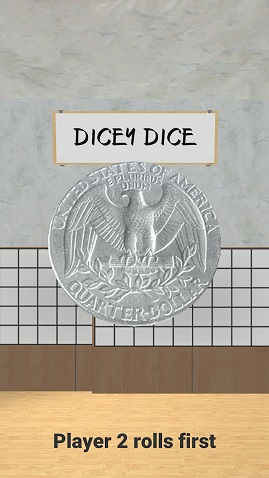
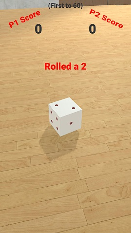
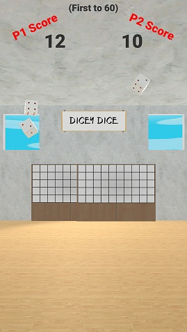

# DiceyDice

A simple dice rolling game for Unity. Features CPU opponent logic, local multiplayer support, accelerometer input, and full implementation of the game loop. The game state is driven by a finite state machine, with camera animations and UI feedback according to the current stage of the game.

